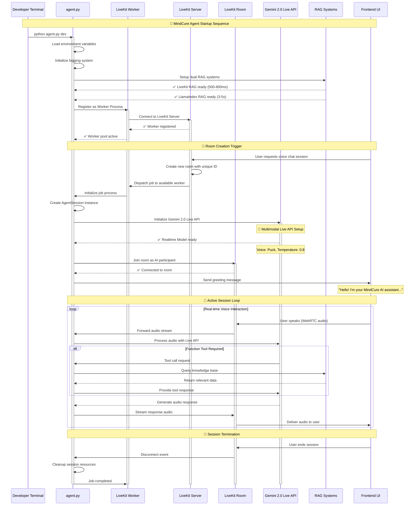
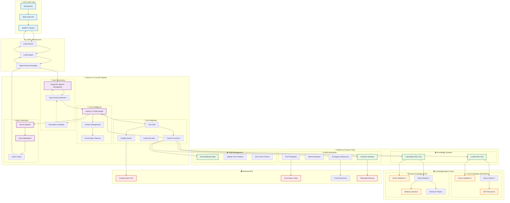
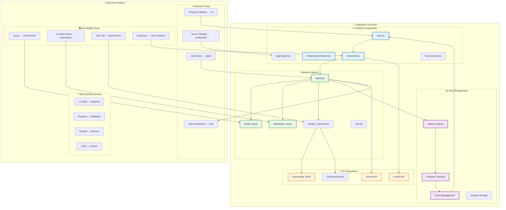
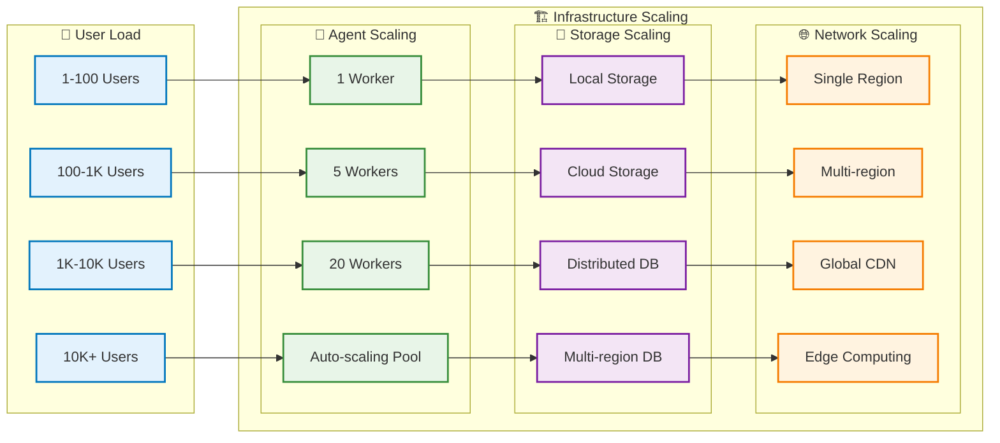

# MindCure System Architecture Visualizations
*Comprehensive Visual Documentation for Dissertation*

## 📊 Visualization Overview

This document contains detailed architectural diagrams and visualizations that illustrate how MindCure's mental wellness platform operates across all layers - from frontend user interfaces to backend AI agents, RAG systems, and external API integrations.

---

## 🏗️ 1. MindCure Complete System Architecture

```mermaid
graph TB
    subgraph "🌐 Frontend Layer - React TypeScript"
        UI[User Interface]
        subgraph "📱 Core Pages"
            LP[Landing Page]
            LG[Login/Signup]
            DB[Dashboard]
            CS[Crisis Support]
            PS[Peer Support]
            PC[Productivity Center]
            TD[Therapist Directory]
            TV[Therapist Video]
            VC[Voice Chat]
            EQ[EQ Evaluation]
            ST[Settings]
        end
        
        subgraph "🧩 Components"
            AH[App Header]
            VCC[VideoCall Component]
            STP[Streaming Text Panel]
            TT[Theme Toggle]
            GT[GenZ Toggle]
            AT[Alert Toast]
            CHP[Conditional Header]
        end
        
        subgraph "🔧 Frontend Services"
            LK[LiveKit Client SDK]
            API[API Layer]
            WS[WebSocket Client]
            SD[Shared Data Store]
        end
    end

    subgraph "🌉 Communication Layer"
        subgraph "📡 Real-time Communication"
            WR[WebRTC]
            WSS[WebSocket Secure]
            HTTP[HTTP/HTTPS]
        end
        
        subgraph "🔄 LiveKit Infrastructure"
            LKS[LiveKit Server]
            LKW[LiveKit Worker Pool]
            LKR[LiveKit Rooms]
            LKA[LiveKit Agent Runtime]
        end
    end

    subgraph "🤖 AI Agent Layer - Python"
        AG[Main Agent - agent.py]
        
        subgraph "🧠 Core Agent Components"
            AS[Agent Session]
            GEM[Gemini 2.0 Flash Live API]
            FT[Function Tools]
            PR[Prompts System]
        end
        
        subgraph "⚡ Function Tools Suite"
            LRT[LiveKit RAG Tool]
            LLT[LlamaIndex RAG Tool]
            AOT[AutoGen Operator Tool]
            WAT[Web Automation Tool]
            FTT[Find Therapists Tool]
            ERT[Emergency Resources Tool]
            GDD[Get Dashboard Data]
            GPD[Get Productivity Data]
            UUP[Update User Progress]
            GCS[Get Current Scores]
        end
    end

    subgraph "📚 Knowledge Management System"
        subgraph "🏃‍♂️ LiveKit RAG (Fast Response 500-800ms)"
            LKI[Vector Index]
            LKE[Embedding Model]
            LKQ[Query Engine]
            LKD[Data Directory]
        end
        
        subgraph "🧠 LlamaIndex RAG (Deep Analysis 3-5s)"
            LLI[Persistent Vector Index]
            LLE[Google Gemini Embeddings]
            LLQ[Advanced Query Engine]
            LLA[Workflow Agent]
            FST[File-Specific Tools]
            VST[Vector Search Tools]
            SST[Summary Tools]
        end
    end

    subgraph "🔗 External Integration Layer"
        subgraph "🌐 Google Services"
            GGA[Google Gemini API]
            GSE[Google Search Engine]
            GEM2[Google Embedding Models]
        end
        
        subgraph "🏥 Healthcare APIs"
            PT[Psychology Today API]
            CR[Crisis Resources API]
            TH[Therapist Directory API]
        end
        
        subgraph "🤖 Automation Services"
            PWR[Playwright WebDriver]
            SEL[Selenium Grid]
            WEB[Web Scraping Engine]
        end
    end

    subgraph "💾 Data Persistence Layer"
        subgraph "📊 Data Storage"
            VDB[Vector Database]
            QES[Query Engine Storage]
            PGS[Progress Storage]
            USS[User Session Storage]
        end
        
        subgraph "📁 File System"
            KD[Knowledge Documents]
            MD[Medical Literature]
            CD[CBT Resources]
            PD[Progress Data]
        end
    end

    subgraph "🔐 Security & Privacy Layer"
        subgraph "🛡️ Security Measures"
            AES[AES-256 Encryption]
            TLS[TLS 1.3]
            JWT[JWT Authentication]
            GDPR[GDPR Compliance]
        end
        
        subgraph "🏥 Healthcare Compliance"
            HIPAA[HIPAA Safeguards]
            SOC[SOC 2 Certification]
            DPA[Data Processing Agreement]
            ZDR[Zero Data Retention]
        end
    end

    %% Frontend to Communication
    UI --> WR
    LK --> LKS
    API --> HTTP
    
    %% Communication to Agent
    LKS --> LKA
    LKW --> AG
    
    %% Agent to Tools
    AG --> FT
    FT --> LRT
    FT --> LLT
    FT --> AOT
    
    %% RAG Systems
    LRT --> LKI
    LLT --> LLI
    LKI --> LKD
    LLI --> KD
    
    %% External Services
    GEM --> GGA
    AOT --> PWR
    FTT --> PT
    
    %% Data Flow
    AG --> VDB
    SD --> USS
    GPD --> PGS
    
    %% Security
    WR --> AES
    HTTP --> TLS
    AG --> HIPAA

    classDef frontend fill:#e1f5fe,stroke:#01579b,stroke-width:2px
    classDef agent fill:#f3e5f5,stroke:#4a148c,stroke-width:2px
    classDef rag fill:#e8f5e8,stroke:#1b5e20,stroke-width:2px
    classDef external fill:#fff3e0,stroke:#e65100,stroke-width:2px
    classDef security fill:#ffebee,stroke:#b71c1c,stroke-width:2px
    
    class UI,LP,LG,DB,CS,PS,PC,TD,TV,VC frontend
    class AG,AS,GEM,FT,LRT,LLT agent
    class LKI,LKQ,LLI,LLA rag
    class GGA,PT,PWR external
    class AES,TLS,HIPAA security
```



---

## 🚀 2. Agent Startup & Room Creation Flow



---

## 🧠 3. Gemini Live API Integration Architecture



---

## 🔄 4. Dual RAG System Architecture

```mermaid
graph TB
    subgraph "🎯 User Query Input"
        UQ[User Query]
        QC[Query Classification]
        QR[Query Routing]
    end

    subgraph "⚡ LiveKit RAG System (Fast Response)"
        subgraph "📊 Simple Vector Store"
            LVD[Vector Database]
            LEM[Text Embeddings]
            LQE[Basic Query Engine]
        end
        
        subgraph "📁 Quick Access Data"
            FAQ[FAQ Documents]
            CBT[CBT Techniques]
            EMG[Emergency Protocols]
            TIP[Quick Tips]
        end
        
        subgraph "🚀 Performance Metrics"
            LT1[Response Time: 500-800ms]
            LAC[Accuracy: 85%]
            LUS[Use Case: Quick Responses]
        end
    end

    subgraph "🧠 LlamaIndex RAG System (Deep Analysis)"
        subgraph "🏗️ Advanced Architecture"
            LWA[Workflow Agent]
            LFT[Function Tools]
            LPI[Persistent Index]
            LSC[Storage Context]
        end
        
        subgraph "🔧 Specialized Tools"
            VST[Vector Search Tools]
            SUM[Summary Tools]
            FSpec[File-Specific Tools]
            QAT[Q&A Tools]
        end
        
        subgraph "📚 Comprehensive Knowledge"
            MED[Medical Literature]
            RES[Research Papers]
            THR[Therapy Protocols]
            PSY[Psychology Journals]
            TRT[Treatment Guidelines]
        end
        
        subgraph "📈 Performance Metrics"
            LT2[Response Time: 3-5s]
            LAC2[Accuracy: 95%]
            LUS2[Use Case: Complex Analysis]
        end
    end

    subgraph "🤖 Google Gemini Integration"
        subgraph "🔤 Text Processing"
            GFL[Gemini 1.5 Flash]
            GTE[Text Embedding 004]
        end
        
        subgraph "🎯 Model Configuration"
            TEMP[Temperature: 0.7]
            CTX[Context Window: 1M tokens]
            API[Google API Key]
        end
    end

    subgraph "💾 Data Persistence"
        subgraph "📁 File System"
            DAT[Data Directory]
            PER[Persist Directory]
            QES[Query Engine Storage]
        end
        
        subgraph "🔄 Index Management"
            IDX[Vector Indices]
            MET[Metadata Storage]
            CHK[Checkpoints]
        end
    end

    subgraph "📊 Query Decision Logic"
        subgraph "⚡ Fast Path Triggers"
            FAQ2[FAQ Questions]
            EMG2[Emergency Queries]
            SIM[Simple Information]
            CRI[Crisis Intervention]
        end
        
        subgraph "🧠 Deep Path Triggers"
            COM[Complex Analysis]
            MUL[Multi-document Synthesis]
            RES2[Research Queries]
            DIA[Diagnostic Support]
        end
    end

    %% Query Flow
    UQ --> QC
    QC --> QR
    
    %% Fast Path
    QR -->|Simple Query| LQE
    LQE --> LVD
    LVD --> FAQ
    LVD --> CBT
    LVD --> EMG
    
    %% Deep Path
    QR -->|Complex Query| LWA
    LWA --> LFT
    LFT --> VST
    LFT --> SUM
    VST --> MED
    VST --> RES
    
    %% Gemini Integration
    LQE --> GFL
    LWA --> GFL
    LVD --> GTE
    LPI --> GTE
    
    %% Data Storage
    LVD --> DAT
    LPI --> PER
    LQE --> QES
    
    %% Decision Logic
    QC --> FAQ2
    QC --> COM
    FAQ2 --> LQE
    COM --> LWA

    classDef query fill:#e3f2fd,stroke:#0277bd,stroke-width:2px
    classDef fast fill:#e8f5e8,stroke:#388e3c,stroke-width:2px
    classDef deep fill:#f3e5f5,stroke:#7b1fa2,stroke-width:2px
    classDef gemini fill:#fff3e0,stroke:#f57c00,stroke-width:2px
    classDef storage fill:#ffebee,stroke:#d32f2f,stroke-width:2px
    
    class UQ,QC,QR query
    class LVD,LQE,FAQ,CBT fast
    class LWA,LFT,MED,RES deep
    class GFL,GTE,TEMP gemini
    class DAT,PER,IDX storage
```



---

## 🌐 5. Frontend-Backend Integration Flow

```mermaid
sequenceDiagram
    participant USER as 👤 User
    participant UI as 🖥️ React Frontend
    participant LK as 📡 LiveKit Client
    participant WS as 🌐 WebSocket
    participant LKS as 🏗️ LiveKit Server
    participant AGENT as 🤖 Python Agent
    participant RAG as 📚 RAG Systems
    participant DB as 💾 Data Store

    Note over USER,DB: 🚀 Complete User Journey Flow

    USER->>UI: Opens MindCure Dashboard
    UI->>UI: Load shared data store
    UI->>DB: Fetch user progress data
    DB-->>UI: Return dashboard metrics
    
    Note over UI: 📊 Dashboard displays:
    Note over UI: Mental Health: 78/100
    Note over UI: Productivity: 85/100
    Note over UI: Streak: 12 days

    USER->>UI: Clicks "Start Voice Chat"
    UI->>LK: Initialize LiveKit connection
    
    LK->>LKS: Request new room creation
    LKS->>LKS: Generate unique room ID
    LKS-->>LK: Return room credentials
    
    LK->>LKS: Join room as participant
    LKS->>AGENT: Dispatch agent to room
    
    AGENT->>LKS: Join room as AI participant
    AGENT->>UI: Send initial greeting
    
    Note over UI: 🎙️ "Hello! I'm your MindCure assistant..."

    USER->>UI: "I'm feeling anxious about work"
    UI->>LK: Capture audio stream
    LK->>LKS: Forward audio via WebRTC
    LKS->>AGENT: Deliver audio to agent

    AGENT->>AGENT: Process with Gemini Live API
    AGENT->>RAG: Query: "anxiety work stress"
    
    alt Quick Response Needed
        RAG->>RAG: Use LiveKit RAG (500ms)
        RAG-->>AGENT: CBT techniques for work anxiety
    else Complex Analysis Needed
        RAG->>RAG: Use LlamaIndex RAG (3s)
        RAG-->>AGENT: Comprehensive anxiety management
    end

    AGENT->>AGENT: Generate personalized response
    AGENT->>LKS: Stream audio response
    LKS->>LK: Forward via WebRTC
    LK->>UI: Play audio response
    UI->>USER: Audio output + transcript

    Note over USER: 🎯 Agent suggests breathing exercise

    USER->>UI: "Can you find therapists near me?"
    UI->>LK: Audio stream
    LK->>LKS: Forward audio
    LKS->>AGENT: Process request

    AGENT->>AGENT: Detect therapist search intent
    AGENT->>AGENT: Call find_therapists_tool
    AGENT->>DB: Query therapist directory
    AGENT->>WS: External API call (Psychology Today)
    WS-->>AGENT: Return therapist results

    AGENT->>LKS: Formatted response with options
    LKS->>LK: Audio + data response
    LK->>UI: Display therapist cards
    UI->>USER: Show therapist options

    USER->>UI: Completes breathing exercise
    UI->>WS: POST /api/progress/update
    WS->>AGENT: Update progress scores
    AGENT->>DB: Increment mental health score
    DB-->>AGENT: Updated scores
    AGENT->>UI: Push score update
    UI->>UI: Animate score change

    Note over UI: 📈 Mental Health: 78 → 82

    USER->>UI: "End session"
    UI->>LK: Disconnect from room
    LK->>LKS: Leave room
    LKS->>AGENT: Session ended event
    AGENT->>AGENT: Cleanup resources
    AGENT->>DB: Save session summary
    UI->>UI: Return to dashboard

    classDef user fill:#e1f5fe,stroke:#01579b,stroke-width:2px
    classDef frontend fill:#f3e5f5,stroke:#4a148c,stroke-width:2px
    classDef backend fill:#e8f5e8,stroke:#1b5e20,stroke-width:2px
    classDef data fill:#fff3e0,stroke:#e65100,stroke-width:2px
    
    class USER user
    class UI,LK frontend
    class AGENT,RAG backend
    class DB,WS data
```

---

## 🛠️ 6. Development & Deployment Architecture

```mermaid
graph TB
    subgraph "💻 Development Environment"
        subgraph "🏗️ Backend Development"
            PY[Python 3.11+]
            UV[UV Package Manager]
            LK[LiveKit Agents SDK]
            GEM[Google Gemini SDK]
            LI[LlamaIndex Framework]
        end
        
        subgraph "🎨 Frontend Development"
            TS[TypeScript]
            REACT[React 18]
            NEXT[Next.js 14]
            TW[Tailwind CSS]
            LKJS[LiveKit React SDK]
        end
        
        subgraph "🔧 Development Tools"
            TASK[Taskfile Automation]
            DOT[Environment Variables]
            LOG[Logging Configuration]
            TEST[Testing Framework]
        end
    end

    subgraph "🐳 Containerization"
        subgraph "📦 Backend Container"
            DFB[Dockerfile Backend]
            PYC[Python Container]
            DEPS[Dependencies Layer]
            APP[Application Layer]
        end
        
        subgraph "🌐 Frontend Container"
            DFF[Dockerfile Frontend]
            NOD[Node.js Container]
            BLD[Build Layer]
            SRV[Serve Layer]
        end
        
        subgraph "🔄 Container Orchestration"
            DC[Docker Compose]
            NET[Custom Networks]
            VOL[Data Volumes]
            ENV[Environment Configs]
        end
    end

    subgraph "☁️ Production Deployment"
        subgraph "🌐 LiveKit Cloud"
            LKC[LiveKit Cloud Service]
            GLB[Global Load Balancer]
            CDN[CDN Distribution]
            MON[Real-time Monitoring]
        end
        
        subgraph "🏗️ Backend Hosting"
            K8S[Kubernetes Cluster]
            POD[Agent Pods]
            SVC[Service Mesh]
            ING[Ingress Controller]
        end
        
        subgraph "🎨 Frontend Hosting"
            VER[Vercel/Netlify]
            SPA[Static Site]
            API[API Routes]
            EDG[Edge Functions]
        end
    end

    subgraph "🔐 Security & Compliance"
        subgraph "🛡️ Authentication"
            JWT[JWT Tokens]
            OAUTH[OAuth 2.0]
            MFA[Multi-Factor Auth]
            SSO[Single Sign-On]
        end
        
        subgraph "🏥 Healthcare Compliance"
            HIPAA[HIPAA Controls]
            GDPR[GDPR Compliance]
            AES[AES-256 Encryption]
            TLS[TLS 1.3]
        end
        
        subgraph "📊 Monitoring"
            LOG2[Structured Logging]
            MET[Metrics Collection]
            ALR[Alerting System]
            TRC[Distributed Tracing]
        end
    end

    subgraph "📊 Data & Analytics"
        subgraph "💾 Data Storage"
            PG[PostgreSQL]
            VDB[Vector Database]
            FIL[File Storage]
            CHE[Cache Layer]
        end
        
        subgraph "📈 Analytics Pipeline"
            ELK[ELK Stack]
            PROM[Prometheus]
            GRAF[Grafana]
            JAEG[Jaeger Tracing]
        end
    end

    %% Development Flow
    PY --> DFB
    REACT --> DFF
    TASK --> DC
    
    %% Containerization
    DFB --> PYC
    DFF --> NOD
    DC --> NET
    
    %% Deployment
    PYC --> K8S
    NOD --> VER
    NET --> LKC
    
    %% Security Integration
    K8S --> JWT
    VER --> TLS
    LKC --> HIPAA
    
    %% Data Integration
    K8S --> PG
    APP --> VDB
    SRV --> CHE
    
    %% Monitoring
    POD --> LOG2
    API --> MET
    LKC --> MON

    classDef dev fill:#e3f2fd,stroke:#0277bd,stroke-width:2px
    classDef container fill:#e8f5e8,stroke:#388e3c,stroke-width:2px
    classDef cloud fill:#f3e5f5,stroke:#7b1fa2,stroke-width:2px
    classDef security fill:#ffebee,stroke:#d32f2f,stroke-width:2px
    classDef data fill:#fff3e0,stroke:#f57c00,stroke-width:2px
    
    class PY,REACT,TASK dev
    class DFB,DFF,DC container
    class LKC,K8S,VER cloud
    class JWT,HIPAA,TLS security
    class PG,VDB,ELK data
```



---

## 🎯 7. Real-time Communication Flow

```mermaid
graph LR
    subgraph "👤 User Device"
        MIC[🎤 Microphone]
        SPK[🔊 Speaker]
        CAM[📷 Camera]
        SCR[💻 Screen]
    end

    subgraph "🌐 WebRTC Pipeline"
        subgraph "📡 Media Capture"
            WA[Web Audio API]
            WV[Web Video API]
            MS[Media Stream]
        end
        
        subgraph "📊 Processing"
            ENC[Audio Encoding]
            DEC[Audio Decoding]
            NS[Noise Suppression]
            AEC[Echo Cancellation]
        end
        
        subgraph "🚀 Transport"
            RTP[RTP Protocol]
            ICE[ICE Candidates]
            STUN[STUN Server]
            TURN[TURN Server]
        end
    end

    subgraph "🏗️ LiveKit Infrastructure"
        subgraph "🌐 SFU Architecture"
            LKS[LiveKit SFU]
            RM[Room Manager]
            PM[Participant Manager]
            SM[Stream Manager]
        end
        
        subgraph "📊 Media Processing"
            MIX[Audio Mixing]
            FWD[Selective Forwarding]
            BW[Bandwidth Management]
            QOS[Quality of Service]
        end
        
        subgraph "🤖 Agent Integration"
            AP[Agent Participant]
            AS[Audio Stream]
            VS[Video Stream]
            DS[Data Stream]
        end
    end

    subgraph "🤖 AI Processing Pipeline"
        subgraph "🎤 Speech Processing"
            VAD[Voice Activity Detection]
            ASR[Speech Recognition]
            NLP[Natural Language Processing]
            INT[Interruption Handling]
        end
        
        subgraph "🧠 Intelligence Layer"
            GM[Gemini 2.0 Model]
            CTX[Context Management]
            TOL[Tool Orchestration]
            MEM[Memory Management]
        end
        
        subgraph "🎵 Response Generation"
            TTS[Text-to-Speech]
            AG[Audio Generation]
            VM[Voice Modulation]
            EMO[Emotion Synthesis]
        end
    end

    %% Input Flow
    MIC --> WA
    CAM --> WV
    WA --> MS
    WV --> MS
    
    %% WebRTC Processing
    MS --> ENC
    ENC --> NS
    NS --> AEC
    AEC --> RTP
    
    %% Transport
    RTP --> ICE
    ICE --> STUN
    STUN --> LKS
    
    %% LiveKit Processing
    LKS --> RM
    RM --> PM
    PM --> SM
    SM --> MIX
    MIX --> AP
    
    %% AI Processing
    AP --> AS
    AS --> VAD
    VAD --> ASR
    ASR --> NLP
    NLP --> GM
    
    %% Intelligence
    GM --> CTX
    CTX --> TOL
    TOL --> MEM
    MEM --> TTS
    
    %% Response Flow
    TTS --> AG
    AG --> VM
    VM --> EMO
    EMO --> AP
    AP --> SM
    SM --> FWD
    FWD --> RTP
    RTP --> DEC
    DEC --> SPK

    classDef device fill:#e3f2fd,stroke:#0277bd,stroke-width:2px
    classDef webrtc fill:#e8f5e8,stroke:#388e3c,stroke-width:2px
    classDef livekit fill:#f3e5f5,stroke:#7b1fa2,stroke-width:2px
    classDef ai fill:#fff3e0,stroke:#f57c00,stroke-width:2px
    
    class MIC,SPK,CAM device
    class WA,ENC,RTP webrtc
    class LKS,RM,MIX livekit
    class VAD,GM,TTS ai
```



---

## 🧩 8. Component Integration Matrix



---

## 📈 Performance & Scalability Metrics

### ⚡ Response Time Breakdown

| Component | Response Time | Use Case |
|-----------|---------------|----------|
| **LiveKit RAG** | 500-800ms | Quick facts, FAQ, CBT techniques |
| **LlamaIndex RAG** | 3-5 seconds | Complex analysis, multi-document synthesis |
| **Gemini Live API** | 200-400ms | Real-time voice processing |
| **WebRTC Stream** | 50-100ms | Audio/video transmission |
| **Tool Execution** | 1-10 seconds | External API calls, web automation |

### 🏗️ Scalability Architecture



---

## 🎨 Visual Design Philosophy

### 🌈 Color Coding System
- **🔵 Blue**: User interfaces and frontend components
- **🟣 Purple**: AI agents and backend processing  
- **🟢 Green**: Knowledge systems and RAG components
- **🟠 Orange**: External APIs and integrations
- **🔴 Red**: Security and compliance layers

### 📊 Diagram Conventions
- **Solid Lines**: Direct data flow
- **Dotted Lines**: Event triggers
- **Arrows**: Direction of communication
- **Subgraphs**: Logical groupings
- **Node Shapes**: Component types

---

## 🔍 Technical Deep Dive Notes

### 🚀 Agent Initialization Process
When `python agent.py dev` is executed:
1. Environment variables loaded from `.env.local`
2. Dual RAG systems initialized in parallel
3. LiveKit worker registers with server
4. Worker pool becomes available for room dispatch
5. Each new room triggers job subprocess creation
6. Agent joins as AI participant with Gemini Live API
7. Real-time audio processing begins immediately

### 🧠 Gemini Live API Integration
- **Multimodal Capabilities**: Audio input/output, text, and vision
- **Real-time Processing**: Sub-second latency for voice interactions
- **Natural Conversation**: Built-in interruption handling and turn detection
- **Tool Integration**: Native function calling with custom tools
- **Voice Selection**: 8 high-quality voices with multilingual support

### ⚡ RAG System Performance
- **LiveKit RAG**: Optimized for speed with simple vector lookup
- **LlamaIndex RAG**: Advanced workflow agent with multi-tool coordination
- **Dual Strategy**: Query classification determines routing for optimal performance
- **Persistent Storage**: Vector indices cached for faster subsequent queries

This comprehensive visualization documentation provides a complete understanding of MindCure's architecture for your dissertation, showing how every component integrates to create a seamless mental wellness platform.
